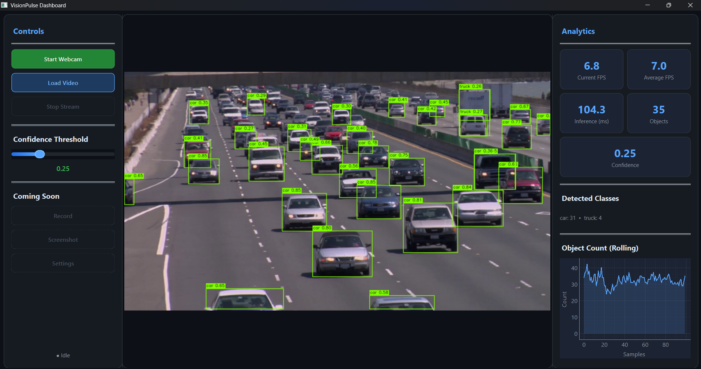

# VisionPulse Dashboard



A professional **Computer Vision Monitoring Dashboard** that performs real-time object detection using **YOLOv8** with a fully responsive **PySide6** desktop interface.

Built with production-grade engineering principles: clean architecture, SOLID design, multithreading, and extensibility.

---

## ✨ Features

- **Real-time Object Detection** — YOLOv8 inference on webcam or video files
- **Responsive GUI** — All CV/AI work runs on a dedicated thread; the UI never freezes
- **Live Analytics** — FPS, inference time, object counts with rolling charts
- **Dark Theme** — Modern, professional interface with hover animations
- **Adjustable Confidence** — Live slider that immediately affects detection sensitivity
- **Error Handling** — Graceful dialogs for missing cameras, corrupt files, and model errors
- **Extensible Architecture** — Swap YOLO for any model by subclassing `BaseDetector`

---

## 🏗️ Architecture

```
┌─────────────────────────────────────────────────────────┐
│                    GUI Thread (Main)                    │
│  ┌──────────┐  ┌──────────────┐  ┌────────────────┐     │
│  │ Control  │  │    Video     │  │   Analytics    │     │
│  │  Panel   │  │    Panel     │  │    Panel       │     │
│  └────┬─────┘  └──────▲───────┘  └──────▲─────────┘     │
│       │               │                 │               │
│       │  signals  ┌───┴─────────────────┘               │
│       ▼           │     signals                         │
│  ┌────────────────┴──────────┐                          │
│  │      VideoWorker          │◄──── QThread             │
│  │  (capture → detect → emit)│                          │
│  └────┬──────────┬───────────┘                          │
│       │          │                                      │
│       ▼          ▼                                      │
│  ┌─────────┐ ┌──────────┐ ┌─────────────────┐           │
│  │ Camera  │ │  Video   │ │  YoloDetector   │           │
│  │ Service │ │  Service │ │ (BaseDetector)  │           │
│  └─────────┘ └──────────┘ └─────────────────┘           │
└─────────────────────────────────────────────────────────┘
```

### Design Principles

| Principle | Implementation |
|-----------|---------------|
| **Single Responsibility** | Each module has exactly one job |
| **Open/Closed** | `BaseDetector` ABC allows new models without modifying existing code |
| **Dependency Inversion** | Worker depends on abstractions (`BaseDetector`), not concrete YOLO |
| **Thread Safety** | Qt Signals/Slots only — no direct widget manipulation from worker |
| **Separation of Concerns** | Services (I/O), Models (AI), Workers (threading), UI (display) |

---

## 📁 Folder Structure
Check the Folder Structure:

```
VisionPulseDashboard/
├── app.py                      # Entry point
├── requirements.txt            # Dependencies
├── README.md
│
├── assets/
│   └── styles/
│       └── dark_theme.qss      # Dark theme stylesheet
│
├── config/
│   └── settings.py             # Centralized configuration
│
├── models/
│   └── detector.py             # BaseDetector ABC + YoloDetector
│
├── workers/
│   └── video_worker.py         # QThread worker
│
├── ui/
│   ├── dashboard.py            # Main window (orchestrator)
│   ├── control_panel.py        # Left panel (controls)
│   ├── video_panel.py          # Center panel (video display)
│   └── analytics_panel.py      # Right panel (stats + chart)
│
├── services/
│   ├── camera_service.py       # Webcam I/O
│   ├── video_service.py        # Video file I/O
│   └── analytics_service.py    # Rolling statistics
│
├── utils/
│   ├── image_converter.py      # BGR→RGB→QImage pipeline
│   └── logger.py               # Logging configuration
│
└── logs/
    └── visionpulse.log         # Runtime logs
```

---

## 🚀 Installation

### Prerequisites

- Python 3.12+
- A webcam (optional - video files work without one)
- Internet connection (for initial YOLOv8 weight download)

### Setup

```bash
# 1. Clone or navigate to the project
cd VisionPulseDashboard

# 2. Create a virtual environment
python -m venv venv
venv\Scripts\activate          # Windows
# source venv/bin/activate     # macOS / Linux

# 3. Install dependencies
pip install -r requirements.txt
```

---

## ▶️ Running

```bash
python app.py
```

On first launch, the YOLOv8 nano model (`yolov8n.pt`, ~6 MB) will be downloaded automatically.

### Controls

| Action | Description |
|--------|-------------|
| **Start Webcam** | Opens the default camera and begins detection |
| **Load Video** | Opens a file dialog to select a video file |
| **Stop Stream** | Halts the current stream |
| **Confidence Slider** | Adjusts detection threshold (0.0–1.0) in real time |

---

## 📊 Analytics Panel

| Metric | Description |
|--------|-------------|
| Current FPS | Instantaneous frames per second |
| Average FPS | Rolling average over last 100 frames |
| Inference (ms) | Time spent on model inference |
| Objects Detected | Count of objects in current frame |
| Confidence | Current confidence threshold |
| Rolling Chart | Object count over last 100 samples |

---

## 🔧 Configuration

All tunables are in [`config/settings.py`](config/settings.py):

```python
ModelSettings.weights_path      = "yolov8n.pt"
ModelSettings.default_confidence = 0.25
VideoSettings.target_fps        = 30
AnalyticsSettings.max_samples   = 100
UISettings.window_title         = "VisionPulse Dashboard"
```

---

## 🔮 Future Roadmap

- [ ] Multiple camera support
- [ ] RTSP / network stream input
- [ ] ONNX Runtime inference
- [ ] TensorRT acceleration
- [ ] Face recognition module
- [ ] Pose estimation
- [ ] Object tracking (DeepSORT)
- [ ] Database logging
- [ ] Alert system (email/webhook)
- [ ] Export analytics (CSV/JSON)
- [ ] REST API for remote monitoring
- [ ] Screenshot & recording

---

## 🐛 Troubleshooting

| Issue | Solution |
|-------|----------|
| **"Could not open webcam"** | Ensure a camera is connected and not in use by another app |
| **"Failed to load model"** | Check internet connection; `pip install ultralytics` |
| **Low FPS** | Use a smaller model (`yolov8n.pt`) or enable CUDA |
| **Import errors** | Ensure you're in the virtual environment with all deps installed |
| **pyqtgraph rendering issues** | Try `pip install --upgrade pyqtgraph PySide6` |

---

## 📄 License

This project is for educational and portfolio purposes.

---

*Built with ❤️ using PySide6, OpenCV, YOLOv8, and pyqtgraph.*
